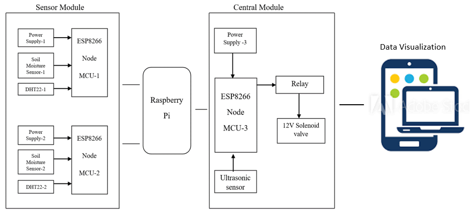

# Learning-IoT
Working with ESP8266 | MQTT | RPi | NodeRED | influxDB I Grafana
# *Plant Monitoring and Automation System*

## PROJECT DESCRIPTION
This project helps us enhance automation in large plant fields, the designed system consists of a number Sensor Nodes, one Control Node and a Raspberry Pi. A Message Queue Telemetry Transport protocol is used for sending and receiving messages between the Nodes. Each Sensor Node consists of a ESP8266 and garden sensors interfaced to it, and the Control Node consists of ESP8266, relay, solenoid valve and an Ultrasonic Sensor. The Sensor Nodes are kept at definite places in the field. Having enabled deep sleep the ESP8266 in the Sensor Nodes wakes up at regular intervals publishes the sensor readings and goes back to sleep, enabling low power consumption. If the moisture level in the soil is low, The Control Node checks for water in the tank and turns on the Solenoid Valve. A Grafana web application is used to visualize and monitor the real time data. The complete setup aids in automating the entire process of monitoring and watering of plants in large fields or gardens.

## COMPONENTS REQUIRED
•	Raspberry Pi3 Model B+
•	SD card 
•	ESP8266 Wi-Fi Module
•	12V Solenoid Valve
•	Tube for Solenoid Valve 
•	DHT22 Humidity and Temperature Sensor
•	Soil Moisture sensor
•	Relay module
•	Jumper wires
•	3.7V 18650 2500mAh Li-Ion Battery 
•	Li-Ion Battery Holder
•	5V Step-Up Module Lithium Battery USB 
•	USB Cable

## SOFTWARE

### Installing ESP8266 Board in Arduino IDE
Arduino IDE is one of the recommended and most commonly used development environment for ESP8266 
Link: [Program ESP8266 with Arduino IDE](https://randomnerdtutorials.com/how-to-install-esp8266-board-arduino-ide/)

### Setting up Raspberry Pi:
Install Raspberry Pi OS (Raspbian) on the Raspberry Pi, using Raspberry Pi Imager from https://www.raspberrypi.org/downloads/
Using the Imager, download and install Raspberry Pi OS onto a 8GB/16 GB micro SD card and insert it in the SD card slot of the Raspberry Pi and power it ON.
Make sure the packages are in its latest version, by typing the following commands in the console.
*sudo apt update*
*sudo apt upgrade*

### Install Mosquitto MQTT broker and clients on Raspberry Pi
Mosquitto is a popular MQTT broker being used. Install both the “mosquitto” package for the broker and the “mosquitto-clients” package for clients for the purpose of testing.
Link: [Steps to install and run Mosquitto Broker](https://randomnerdtutorials.com/how-to-install-mosquitto-broker-on-raspberry-pi/)

### Install Node-RED on Raspberry Pi
Node-RED is an open-source flow-based programming tool, designed for IoT, Node-RED is easy to use and also provides a browser-based editor.
Link: [Steps to install Node-RED](https://pimylifeup.com/node-red-raspberry-pi/)

### Install Influx DB on Raspberry Pi
InfluxDB is a time-series database system, which helps in monitoring metrics and events. Each datapoint in the database will contain a timestamp.
Link: [Steps to install InfluxDB](https://pimylifeup.com/raspberry-pi-influxdb/)

### Install Grafana on Raspberry Pi
Grafana is an open-source analytics and monitoring web application, which helps us in monitoring data over time. It provides various visualizations such as charts, graphs, gauges, stats and also has alerting features enabled.
Link: [Steps to install Grafana](https://pimylifeup.com/raspberry-pi-grafana/)

### Install Avahi software in Raspberry Pi for mDNS:
*sudo apt-get update*
*sudo apt-get install avahi-utils*
*sudo apt-get install avahi-daemon*
*sudo nano /etc/avahi/services/mosquitto.service*
Paste the following text:

<!DOCTYPE service-group SYSTEM "avahi-service.dtd">
<service-group>
 <name replace-wildcards="yes">Mosquitto MQTT server on %h</name>
  <service>
   <type>_mqtt._tcp</type>
   <port>1883</port>
   <txt-record>info=Publish, Publish! Read all about it! mqtt.org</txt-record>
  </service>
</service-group>

Close the file
*avahi-browse -a*
To find the hostname for hostname.local
*sudo cat /etc/hostname*

